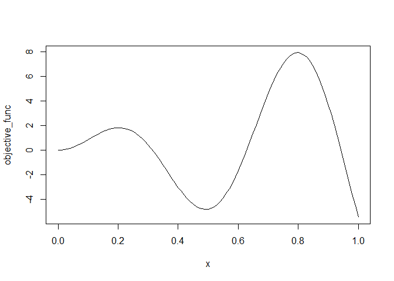

# An R Implementation of Bayesian Optimization
Koji MAKIYAMA (@hoxo_m)  


[](https://travis-ci.org/hoxo-m/bayesopt)
[](http://cran.rstudio.com/web/packages/bayesopt)

## Usage


```r
objective_func <- function(x) {
  x <- x * 10
  x * sin(x)
}

plot(objective_func)
```

<!-- -->


```r
x <- seq(0, 1, length.out = 100)

library(bayesopt)
set.seed(314)
bo1 <- bayesopt(objective_func, x, iter = 15)
cat(sprintf("The best parameter is {'x': %f} with a score of %f", bo1$opt_x, bo1$opt_y))
```

```
## The best parameter is {'x': 0.797980} with a score of 7.916722
```


```r
library(GPfit)
plot(bo1$gp[[12]])
```

<!-- -->

## Related Work

- [rBayesianOptimization](https://cran.r-project.org/web/packages/rBayesianOptimization/index.html)

